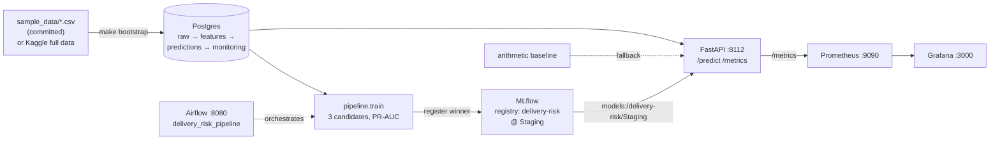

# Delivery-Risk MLOps

An end-to-end MLOps platform that predicts **late-delivery risk** for [Olist](https://www.kaggle.com/datasets/olistbr/brazilian-ecommerce)
e-commerce orders **at purchase time** — early enough for an operations team to intervene.
It covers the full lifecycle in one `docker compose up`: raw data → leak-free feature
engineering → model training & registry → a FastAPI serving contract → batch scoring →
Airflow orchestration → drift monitoring → Prometheus/Grafana dashboards.

The point of this project is the **pipeline and operations**, not squeezing out model accuracy:
reproducible data flow, a clean training→registry→serving handoff, orchestration, observability,
and a service that degrades gracefully instead of hard-failing.

> **Full technical write-up:** [`docs/PROJECT_DOCUMENTATION.md`](docs/PROJECT_DOCUMENTATION.md)
> — architecture, data, feature engineering, the temporal-leakage firewall, model selection,
> every API endpoint, Airflow, MLflow, Prometheus/Grafana, and CI/CD.

## Quickstart

```bash
docker compose up -d --build     # postgres, mlflow, api, airflow, prometheus, grafana
make bootstrap                   # load -> features -> train -> register -> predict -> monitor
```

`make bootstrap` uses the committed synthetic `sample_data/`, so **no external data or
credentials are needed**. Before it runs, the API already answers on a safe arithmetic
baseline; after it runs, the API serves the model registered in MLflow.

| Service | URL | Notes |
|---|---|---|
| API (FastAPI) | http://localhost:8112/docs | prediction + observability endpoints |
| MLflow | http://localhost:5312 | experiments + model registry |
| Airflow | http://localhost:8080 | DAG `delivery_risk_pipeline` (login `admin`/`admin`) |
| Prometheus | http://localhost:9090 | scrapes the API |
| Grafana | http://localhost:3000 | auto-provisioned dashboard (anonymous viewer) |

Want the real dataset? Provide Kaggle credentials, then:

```bash
make fetch-data                  # downloads olistbr/brazilian-ecommerce into olist_data/
make bootstrap DATA=full         # runs the pipeline on the full dataset
```

## Architecture



The service resolves its model in order — **MLflow `Staging`** → **local `artifacts/model.joblib`**
→ **arithmetic baseline** — so it never hard-fails startup; `/health` reports which backend is active.

## The API contract

| Endpoint | Purpose |
|---|---|
| `GET /health` | liveness + which model backend is serving |
| `GET /model-info` | registered model name/version/stage, feature count, leakage policy |
| `POST /predict` | score one order |
| `POST /batch-predict` | score a list of orders |
| `GET /metrics-summary` | human-readable roll-up of the Prometheus metrics |
| `GET /metrics` | Prometheus exposition (`delivery_*` series) |
| `GET /deploy-status` | recent deploy history (`?format=html` renders a flowchart) |

Each prediction returns exactly `order_id`, `late_delivery_probability`, `risk_level`,
`recommended_action`, `model_version`, and `latency`.

## Modelling approach

- **Target:** `is_late_delivery` — delivered after the estimated delivery date.
- **Temporal-leakage firewall:** predictions use **only purchase-time inputs**. Delivery-outcome,
  review, and actual-delivery fields are never features. Enforced in three layers — the feature
  SQL selects purchase-time columns only, the Pydantic schema is `extra="forbid"`, and an explicit
  denylist rejects known-leaky fields.
- **Class imbalance:** late orders are the minority (~8% in the full Olist data), so models are
  compared by **PR-AUC / average precision** with class/sample weighting.
- **Temporal validation:** train on the earliest 80% of purchases, validate on the newest 20%, so
  metrics respect real late-rate drift and never peek at the future.
- **Three candidates** (logistic regression, random forest, hist gradient boosting) are logged to
  MLflow; the PR-AUC winner is registered as `delivery-risk` and promoted to `Staging`.

## Repository layout

| Path | What |
|------|------|
| `app/` | FastAPI service — routes, contract + leakage firewall, model resolution, Prometheus metrics, deploy-status view |
| `pipeline/` | `load_raw`, `features`, `train`, `register`, `batch_predict`, `monitor`, `smoke_test`, `db` |
| `airflow/dags/delivery_risk_pipeline.py` | the orchestration DAG (runs each pipeline step locally) |
| `airflow/Dockerfile` | Airflow image with the pipeline installed in an isolated venv |
| `sample_data/` | committed synthetic Olist-shaped dataset for the zero-config demo |
| `scripts/` | `make_sample_data.py` (regenerate the sample), `fetch_data.sh` (Kaggle download) |
| `grafana/` | dashboard JSON + provisioning (datasource + dashboard) |
| `ci/` | `record_run.py` — deploy-record helper feeding `/deploy-status` |
| `docs/` | full project documentation + images |
| `docker-compose.yaml`, `prometheus.yml`, `Makefile` | the stack, scrape config, task runner |

## Orchestration

The Airflow DAG `delivery_risk_pipeline` runs the full cycle —
`load_raw_data → build_features → train_model → register_model → api_smoke_test →
batch_predict → monitor → decide_retrain → [flag_retrain | no_retrain]`. Each step runs the same
`python -m pipeline.X` entrypoint that `make bootstrap` uses, so a DAG trigger and a manual
bootstrap are equivalent. `decide_retrain` is **surface-and-alert, not auto-retrain**.

## Observability

- **Service metrics → Prometheus → Grafana.** `GET /metrics` exposes request/error counters,
  latency histograms, prediction counts by risk level, a model-loaded gauge, and deploy gauges
  (all `delivery_*`). Grafana auto-provisions the datasource and dashboard on startup.
- **Model/data monitoring → Postgres.** `pipeline/monitor.py` computes PSI on the score and key
  features plus recent-window ROC-AUC, writes `monitoring_metrics`, and decides retrain
  (`score/feature PSI > 0.2` or `AUC < 0.65`).
- **Structured JSON logs** with a per-request `X-Request-ID`.

## Development

```bash
make test                           # run the test suite in the API image
pytest -q tests                     # or locally, with deps installed and PYTHONPATH=.
python scripts/make_sample_data.py  # regenerate the committed sample dataset
```

CI runs in GitHub Actions (`.github/workflows/ci.yml`): tests, Docker build, and
`docker compose config` validation on every push/PR.

## Tech stack

Python · FastAPI · scikit-learn · MLflow · Apache Airflow · PostgreSQL · Prometheus · Grafana ·
Docker Compose · GitHub Actions.

## License

[MIT](LICENSE)
