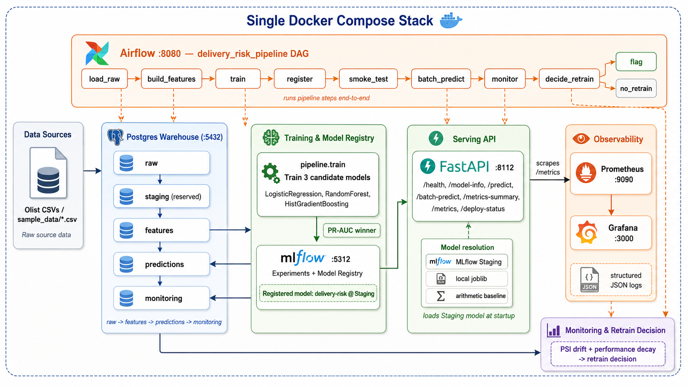
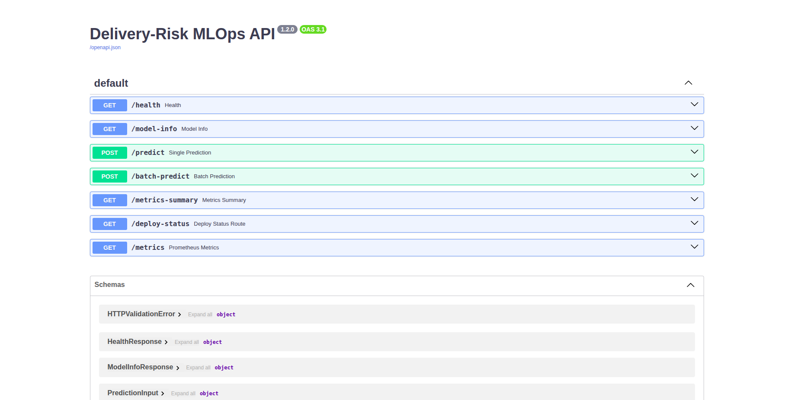
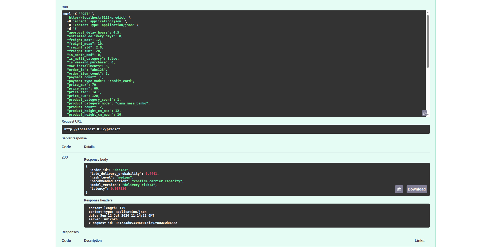
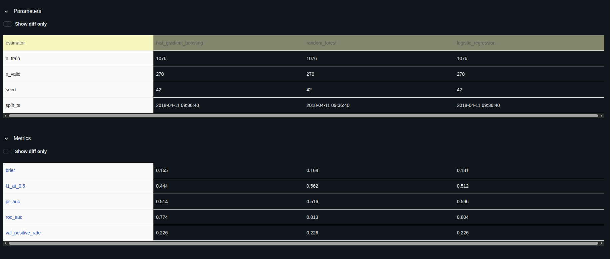
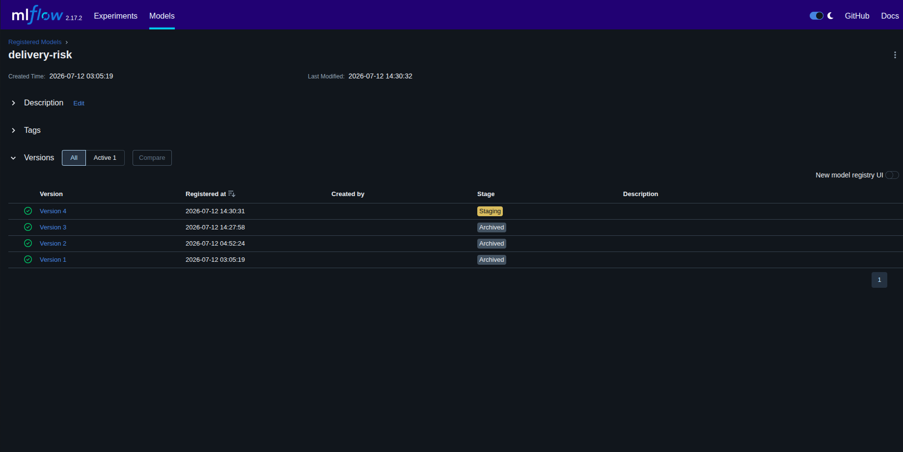
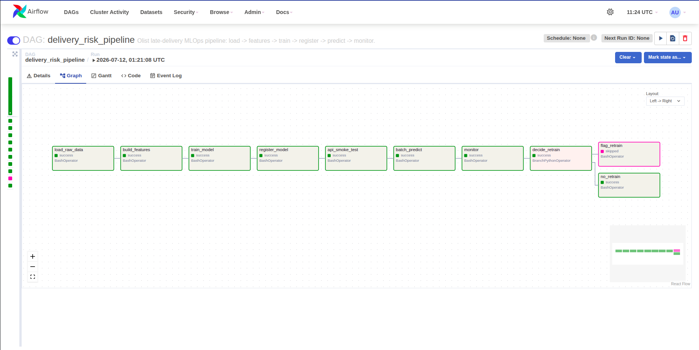
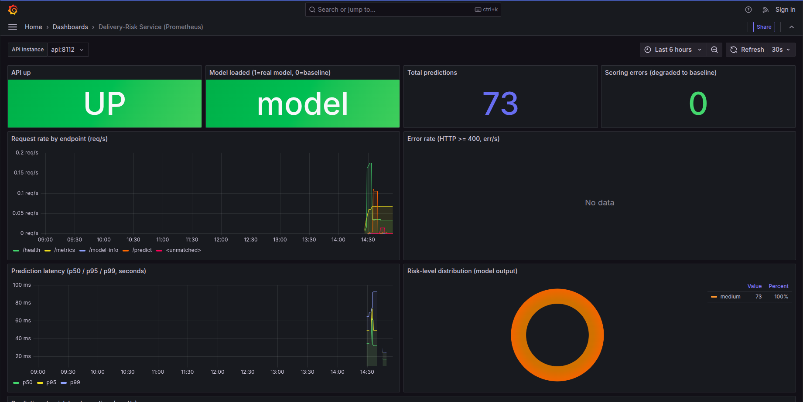
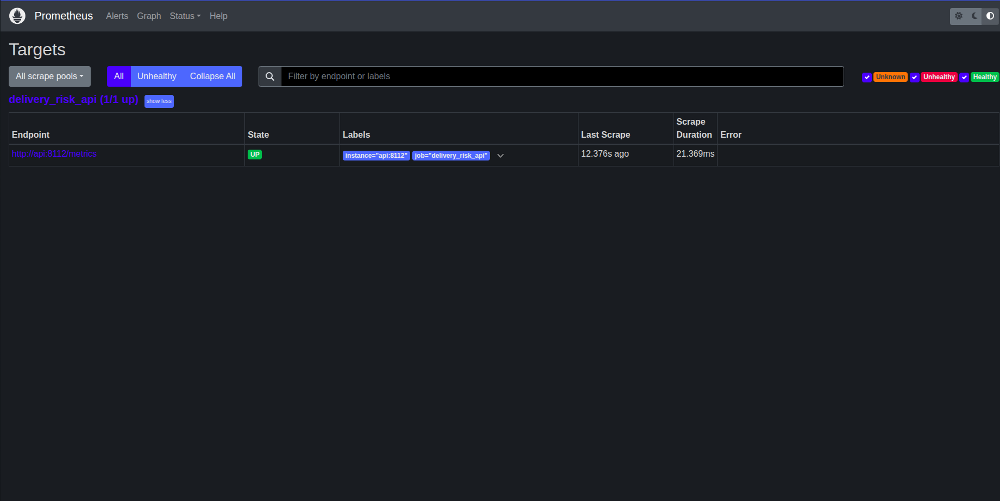
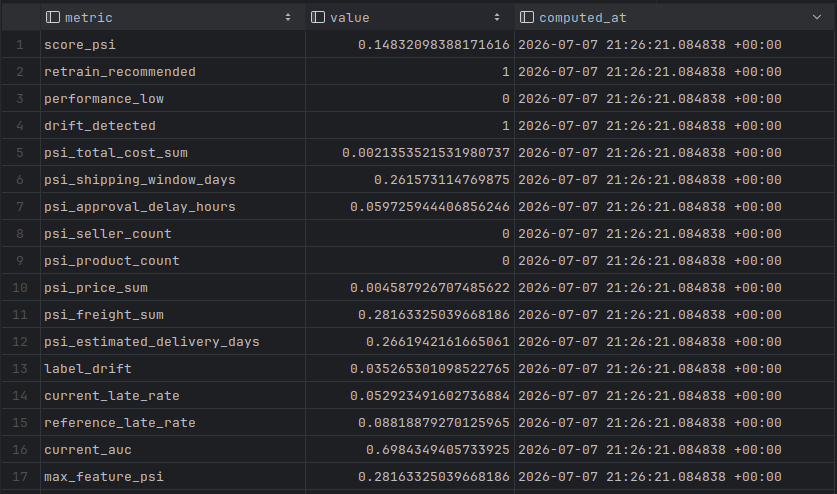

<!--
  SCREENSHOT PLACEHOLDERS
  ───────────────────────
  Image references below point at docs/images/<name>.png. Until you drop the real
  files in, those images render broken on GitHub — that's expected. Each placeholder
  has an HTML comment telling you exactly what to capture and the filename to save.
  Replace <OWNER> in the badge/clone URLs with your GitHub username once the repo is pushed.
-->

# Delivery-Risk MLOps

**Predict late-delivery risk for [Olist](https://www.kaggle.com/datasets/olistbr/brazilian-ecommerce)
e-commerce orders — at purchase time — so an operations team can intervene before an order ships.**

<!-- Replace <OWNER> below with your GitHub username after pushing. -->
[](https://github.com/<OWNER>/delivery-risk-mlops/actions/workflows/ci.yml)
[](LICENSE)


This is an **end-to-end MLOps platform**, not a notebook. The whole lifecycle runs locally in a
single `docker compose up`: raw data → leak-free feature engineering → model training & registry →
a FastAPI serving contract → batch scoring → Airflow orchestration → drift monitoring →
Prometheus/Grafana dashboards. The emphasis is **reproducible data flow, a clean
training→registry→serving handoff, orchestration, observability, and graceful degradation** — not
squeezing out the last point of model accuracy.



---

## Table of contents

- [Highlights](#highlights)
- [Quickstart](#quickstart)
- [Screenshots](#screenshots)
- [Architecture](#architecture)
- [The problem & the data](#the-problem--the-data)
- [Modelling approach & results](#modelling-approach--results)
- [The temporal-leakage firewall](#the-temporal-leakage-firewall)
- [MLOps lifecycle: one command = one DAG](#mlops-lifecycle-one-command--one-dag)
- [The API contract](#the-api-contract)
- [Observability](#observability)
- [Monitoring, drift & the retrain decision](#monitoring-drift--the-retrain-decision)
- [CI/CD](#cicd)
- [Running on the full dataset](#running-on-the-full-dataset)
- [Development](#development)
- [Project structure](#project-structure)
- [Tech stack](#tech-stack)
- [Roadmap & known limitations](#roadmap--known-limitations)
- [License](#license)

---

## Highlights

- **One-command stack.** `docker compose up` brings up Postgres, MLflow, the API, Airflow,
  Prometheus, and Grafana; `make bootstrap` runs the whole pipeline against committed **synthetic**
  data — **no external data or credentials required**.
- **Graceful degradation.** The API resolves its model MLflow `Staging` → local joblib →
  arithmetic baseline, and **never hard-fails on startup**. `/health` reports which backend is live.
- **A real leakage firewall.** Predictions use **purchase-time inputs only**, enforced in three
  independent layers so no single mistake re-opens the leak.
- **Reproducible train→register→serve handoff** through the MLflow model registry.
- **Orchestration that mirrors the CLI.** `make bootstrap` and the Airflow DAG run the *same*
  pipeline steps in the same order — no drift between "how I ran it" and "how it's scheduled."
- **Full observability.** Prometheus metrics, an auto-provisioned Grafana dashboard, PSI drift
  monitoring with an explicit retrain decision, and structured JSON logs with per-request IDs.
- **CI + selective CD in GitHub Actions** — every push runs tests, a Docker build, and compose
  validation; on `main`, a change-scoped deploy validates *only what changed* (and, for pipeline
  changes, a full train→register→serve run on a throwaway stack) before touching the live product.

---

## Quickstart

**Requirements:** Docker + Docker Compose. That's it.

```bash
git clone https://github.com/<OWNER>/delivery-risk-mlops.git
cd delivery-risk-mlops
make demo                        # up (wait until healthy) -> bootstrap -> reload api. That's it.
```

`make demo` brings up the whole stack, runs the pipeline once against the committed synthetic
`sample_data/`, and reloads the API to serve the freshly trained model — **no external data or
credentials needed**. (Prefer the raw steps? `make up` then `make bootstrap` do the same thing.)

| Service | URL | Notes |
|---|---|---|
| **API** (FastAPI) | http://localhost:8112/docs | prediction + observability endpoints |
| **MLflow** | http://localhost:5312 | experiments + model registry |
| **Airflow** | http://localhost:8080 | DAG `delivery_risk_pipeline` (login `admin` / `admin`) |
| **Prometheus** | http://localhost:9090 | scrapes the API |
| **Grafana** | http://localhost:3000 | auto-provisioned dashboard (anonymous viewer) |

```bash
make down     # stop the stack (keep data)
make clean    # stop and wipe volumes (data/models/mlflow)
make logs     # tail all service logs
```

---

## Screenshots

> Drop your captures into `docs/images/` using the filenames below and they'll appear here.

### FastAPI — interactive contract (`/docs`)


### A scored prediction
<!-- SCREENSHOT: a POST /predict request + JSON response (from Swagger "Try it out" or a curl).
     Save as: docs/images/api-predict.png -->


### MLflow — three candidates compared
<!-- SCREENSHOT: the MLflow experiment view showing the 3 model runs with PR-AUC / ROC-AUC columns.
     Save as: docs/images/mlflow-experiments.png -->


### MLflow — the registered model at `Staging`


### Airflow — the pipeline DAG (successful run)


### Grafana — the service dashboard
<!-- SCREENSHOT: the auto-provisioned Grafana dashboard with live panels (after a few requests).
     Save as: docs/images/grafana-dashboard.png -->


### Prometheus — the API scrape target
<!-- SCREENSHOT: Prometheus Status -> Targets showing the delivery_risk_api target UP.
     Save as: docs/images/prometheus-targets.png -->


---

## Architecture

The diagram above is one `docker-compose.yaml` stack — six services (Postgres, MLflow, the API,
Airflow, Prometheus, Grafana), with the medallion schemas, pipeline stages, and DAG steps grouped
inside them. Two design choices worth calling out:

- **Model resolution is a chain, not a hard dependency.** The service tries MLflow `Staging`, then
  a mounted `MODEL_PATH` joblib, then a bounded arithmetic baseline — gated by a fast TCP probe so a
  down tracking server never stalls startup.
- **The pipeline runs in an isolated virtualenv inside the Airflow image.** The pipeline pins
  SQLAlchemy 2.x (which conflicts with Airflow's 1.4), so it lives in its own interpreter; Airflow's
  own metadata DB and scheduler are untouched.

Full write-up: **[`docs/PROJECT_DOCUMENTATION.md`](docs/PROJECT_DOCUMENTATION.md)**.

---

## The problem & the data

Olist is a Brazilian e-commerce marketplace. A meaningful share of orders arrive **later than the
estimated delivery date** promised at checkout. If we can flag high-risk orders **at purchase
time**, operations can expedite fulfilment, confirm carrier capacity, or proactively notify the
customer — *before* the order ships.

- **Source:** the public Olist dataset (~100k orders across customers, order-items, payments,
  products, sellers, reviews).
- **Warehouse:** a Postgres **medallion** layout — `raw → features → predictions → monitoring`
  (each a schema; all collapse to `public` for the single-schema local demo).
- **Target:** `is_late_delivery` — delivered after the estimated delivery date (~8% positive on the
  full data, so it's a **class-imbalanced** problem).

The repo ships a **committed synthetic `sample_data/`** (Olist-shaped, generated by
`scripts/make_sample_data.py`) so the demo is zero-config and safe to publish.

---

## Modelling approach & results

- **Temporal validation.** Train on the earliest 80% of purchases, validate on the newest 20%, so
  the score respects real late-rate drift and never peeks at the future.
- **Imbalance-aware selection.** Because late orders are the minority, candidates are compared by
  **PR-AUC (average precision)** with class/sample weighting — not raw accuracy.
- **Three credible candidates** are logged to MLflow; the PR-AUC winner is registered as
  `delivery-risk` and promoted to `Staging`.

**Results on the full Olist dataset** (train ≈ 77k, valid ≈ 19k):

| Model | PR-AUC | ROC-AUC |
|---|---:|---:|
| LogisticRegression | 0.066 | 0.586 |
| RandomForest | 0.089 | 0.659 |
| **HistGradientBoosting (winner)** | **0.154** | **0.720** |

The dominant predictor is the **shipping window** — the gap between the seller's shipping deadline
and the promised delivery date.

<!-- Existing chart. NOTE: the plot TITLE reads "Group02 late-delivery model" — regenerate it
     (see docs/PROJECT_DOCUMENTATION.md §5.3 command) so the title matches the standalone project. -->


> The committed `sample_data/` is smaller and easier, so the zero-config demo trains a real model in
> seconds with different numbers — the mechanics, not the metrics, are the point.

---

## The temporal-leakage firewall

The single most important correctness property: **a prediction may only use information knowable at
the moment of purchase.** Delivery-outcome, carrier, and review fields would leak the future and
make the model look great offline yet useless in production. Three independent layers enforce it:

1. **Feature SQL** (`pipeline/features.py`) selects purchase-time columns only.
2. **Request schema** (`app/schemas.py`) is Pydantic `extra="forbid"` — unknown fields are rejected.
3. **Explicit denylist** (`FORBIDDEN_FIELDS` in `app/config.py`, checked by `app/predictor.py`)
   returns a clear `400` if a known-leaky field ever appears.

The ordered `FEATURE_COLUMNS` list in `app/config.py` doubles as the model's input schema and the
API's public contract.

---

## MLOps lifecycle: one command = one DAG

`make bootstrap` and the Airflow DAG `delivery_risk_pipeline` run the **same** steps, in the same
order, via the same `python -m pipeline.X` entrypoints:

```
load_raw → build_features → train → register → api_smoke_test → batch_predict → monitor
        → decide_retrain → [flag_retrain | no_retrain]
```

So "how I ran it by hand" and "how it's orchestrated" can never drift apart. The DAG is **on-demand**
(`schedule=None`) — an operational pipeline you trigger, not a cron job — and `decide_retrain`
**surfaces** a retrain recommendation rather than auto-retraining.

---

## The API contract

| Endpoint | Purpose |
|---|---|
| `GET /health` | liveness + which model backend is serving |
| `GET /model-info` | registered model name/version/stage, feature count, leakage policy |
| `POST /predict` | score one order |
| `POST /batch-predict` | score a list of orders |
| `GET /metrics-summary` | human-readable roll-up of the Prometheus metrics |
| `GET /metrics` | Prometheus exposition (`delivery_*` series) |
| `GET /deploy-status` | recent deploy history (`?format=html` renders a flowchart) |

Each prediction returns exactly:

```json
{
  "order_id": "abc123",
  "late_delivery_probability": 0.63,
  "risk_level": "high",
  "recommended_action": "prioritize fulfillment intervention",
  "model_version": "delivery-risk:3",
  "latency": 0.004
}
```

Risk banding (`late_delivery_probability` → `risk_level`) is configurable via
`HIGH_RISK_THRESHOLD` / `MEDIUM_RISK_THRESHOLD`, keeping **policy** separate from the **model**.

---

## Observability

- **Metrics → Prometheus → Grafana.** `GET /metrics` exposes request/error counters, latency
  histograms, prediction counts by risk level, a model-loaded gauge, and deploy gauges — all
  prefixed `delivery_`. Prometheus scrapes the API under job `delivery_risk_api`; Grafana
  **auto-provisions** the datasource and dashboard on startup (`grafana/provisioning/`).
- **Structured JSON logs** with a per-request `X-Request-ID` for correlation.
- **`GET /metrics-summary`** gives the same data pre-aggregated for humans — no PromQL needed.

---

## Monitoring, drift & the retrain decision

`pipeline/monitor.py` computes **PSI (Population Stability Index)** on the prediction score and key
features, plus recent-window **ROC-AUC**, writes them to the `monitoring_metrics` table, and emits
a retrain verdict:

> retrain recommended if **score/feature PSI > 0.2** or **recent AUC < 0.65**.

This is **record-and-alert, not auto-retrain** — retraining on the data you just trained on is a
foot-gun, so the decision is surfaced for a human to action.

The `monitoring_metrics` table after a run — PSI per feature, drift/decay flags, and the retrain verdict:

<!-- Existing screenshot: the monitoring_metrics table (score_psi, psi_*, retrain_recommended, current_auc).
     Content-neutral, safe to keep. Recapture from the new stack if you want fresh numbers. -->


---

## CI/CD

**CI — `.github/workflows/ci.yml`** runs on every push/PR (on GitHub-hosted runners):

1. install deps + run `pytest` (on **Python 3.12**, matching the runtime),
2. `docker build` the API image,
3. `docker compose config` validation.

**Selective CD — `.github/workflows/cd.yml`** runs on every push to `main` and applies changes to
the live stack **only after scope-specific validation passes**, touching nothing outside the scope
that changed. The rule is: `main` must never leave the running product broken.

| What changed | Validate | Apply |
|---|---|---|
| `app/**` only | run tests | rebuild + restart **only** the api |
| pipeline / serving deps / compose (`pipeline/**`, `airflow/**`, `Dockerfile`, `requirements.txt`, `docker-compose*.yaml`, `Makefile`, …) | run tests **and** a full `load→features→train→register→predict→monitor` run on an isolated throwaway stack, asserting the api serves the freshly registered model | rebuild api + airflow, then run the pipeline on live |
| `grafana/**` | validate the dashboard JSON parses | recreate **only** grafana |

A successful end-to-end pipeline run is part of the gate — pipeline code is never applied to live
until it has trained, registered, and served a model on an ephemeral stack (isolated via
`docker-compose.ci.yml`: a distinct project name, reset host ports, and a non-live image tag, so it
can't disturb the live stack on the same host). This is what catches a train/serve mismatch before
it can ship a broken product.

CD runs on a **self-hosted runner** (the machine that hosts the live stack) and deploys into a
dedicated checkout named by the repo variable `DEPLOY_DIR`. One-time host setup is automated by
**`scripts/setup-self-hosted-runner.sh`** (installs `gh`, creates/pushes the GitHub repo if needed,
clones `DEPLOY_DIR`, sets the variable, and registers + starts the runner).

Deploy history is surfaced through the API's `/deploy-status` endpoint, fed by `ci/record_run.py`.

---

## Running on the full dataset

The demo uses synthetic data by default. To train on the real ~100k-order Olist data, you need a
free Kaggle API token — but **nothing to install**: the download runs in a container.

1. Create a token at **kaggle.com → Settings → API → "Create New Token"** (downloads `kaggle.json`).
2. Copy `.env.example` → `.env` and paste the two values:
   ```bash
   cp .env.example .env
   # then set:
   KAGGLE_USERNAME=your_kaggle_username
   KAGGLE_KEY=your_kaggle_api_key
   ```
3. Run it end to end:
   ```bash
   make demo DATA=full          # fetch (in a container) -> up -> bootstrap on full data -> reload api
   ```

`make fetch-data` downloads `olistbr/brazilian-ecommerce` into `olist_data/` (gitignored), and
`DATA=full` points the pipeline's `RAW_DATA_DIR` there instead of at `sample_data/`.

---

## Development

```bash
make test                              # run the suite inside the api image (no host Python needed)
PYTHONPATH=. pytest -q tests           # or locally, with deps installed
PYTHONPATH=. pytest tests/test_api.py -k <pattern>   # a single test
python scripts/make_sample_data.py     # regenerate the committed sample dataset
```

Configuration is **environment-variable only** (12-factor): `app/config.py` for the API,
`pipeline/db.py` for the database. `docker-compose.yaml` supplies every value via service names;
copy `.env.example` → `.env` for host-side runs. See [`docs/PROJECT_DOCUMENTATION.md`](docs/PROJECT_DOCUMENTATION.md) for the engineering
notes future contributors need.

---

## Project structure

| Path | What |
|------|------|
| `app/` | FastAPI service — routes, contract + leakage firewall, model resolution, Prometheus metrics, deploy-status view |
| `pipeline/` | `load_raw`, `features`, `train`, `register`, `batch_predict`, `monitor`, `smoke_test`, `db` |
| `airflow/dags/delivery_risk_pipeline.py` | the orchestration DAG (runs each pipeline step locally) |
| `airflow/Dockerfile` | Airflow image with the pipeline installed in an isolated venv |
| `sample_data/` | committed synthetic Olist-shaped dataset for the zero-config demo |
| `scripts/` | `make_sample_data.py` (regenerate the sample), `fetch_data.sh` (Kaggle download), `setup-self-hosted-runner.sh` (one-time CD host setup) |
| `grafana/` | dashboard JSON + provisioning (datasource + dashboard) |
| `ci/` | `record_run.py` — deploy-record helper feeding `/deploy-status` |
| `.github/workflows/` | `ci.yml` (tests + build), `cd.yml` (selective, change-scoped deploy) |
| `docs/` | full project documentation + images |
| `docker-compose.yaml`, `docker-compose.ci.yml`, `prometheus.yml`, `Makefile` | the stack, the CI/isolation override, scrape config, task runner |

---

## Tech stack

Python 3.12 · FastAPI · scikit-learn · MLflow · Apache Airflow · PostgreSQL · Prometheus · Grafana ·
Docker Compose · GitHub Actions.

---

## Roadmap & known limitations

- **Customer geography is the biggest missing signal.** Modelling seller↔customer distance (e.g. a
  `customer_seller_same_state` interaction) is the most promising accuracy improvement.
- Accuracy is deliberately not the focus — the platform is. See
  [`docs/PROJECT_DOCUMENTATION.md` §20](docs/PROJECT_DOCUMENTATION.md) for the full list.

---

## License

[MIT](LICENSE)
