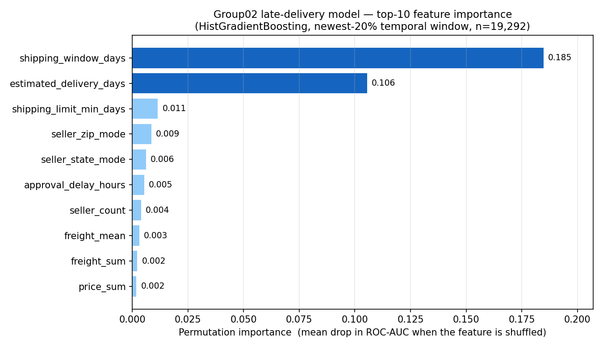

# Delivery-Risk MLOps: Full Project Documentation

> This document is the end-to-end write-up of the delivery-risk platform. It walks through the
> problem, the data, feature engineering, model training and selection, the FastAPI serving
> layer, Airflow orchestration, MLflow tracking, Prometheus/Grafana observability, CI/CD,
> security/isolation, and repository hygiene.

---

## Table of Contents

1. [Executive summary](#1-executive-summary)
2. [System architecture](#2-system-architecture)
3. [Infrastructure & environments](#3-infrastructure--environments)
4. [Data: the Olist dataset & ingestion](#4-data-the-olist-dataset--ingestion)
5. [Feature engineering (and the single most impactful feature)](#5-feature-engineering)
6. [Temporal-leakage firewall](#6-temporal-leakage-firewall)
7. [Model training & selection](#7-model-training--selection)
8. [MLflow: experiments, runs & the registry](#8-mlflow-experiments-runs--the-registry)
9. [Batch prediction](#9-batch-prediction)
10. [Monitoring, drift detection & the retrain decision](#10-monitoring-drift-detection--the-retrain-decision)
11. [Airflow orchestration](#11-airflow-orchestration)
12. [The FastAPI service (endpoints & code)](#12-the-fastapi-service)
13. [Observability: Prometheus metrics](#13-observability-prometheus-metrics)
14. [Observability: Grafana dashboard](#14-observability-grafana-dashboard)
15. [Observability: structured logging](#15-observability-structured-logging)
16. [CI/CD](#16-cicd)
17. [Docker & deployment](#17-docker--deployment)
18. [Security & isolation](#18-security--isolation)
19. [Repository organization](#19-repository-organization)
20. [Known limitations & future work](#20-known-limitations--future-work)
21. [Appendix A — Demo walkthrough](#appendix-a--demo-walkthrough)
22. [Appendix B — Command reference](#appendix-b--command-reference)

---

## 1. Executive summary

**The problem.** Olist is a Brazilian e-commerce marketplace. A meaningful share of orders are
delivered *later than the estimated delivery date* promised to the customer. If an operations
team could know **at purchase time** which orders are at high risk of being late, they could
intervene early (expedite fulfilment, confirm carrier capacity, proactively notify the customer).

**What we built.** A complete MLOps platform that:

- **loads** the raw Olist CSVs into a Postgres **medallion** database (raw → features →
  predictions → monitoring);
- **engineers** a leak-free, purchase-time-only feature table (`featureset_v1`, 45 features);
- **trains and compares** three credible model families in **MLflow**, on a strict *temporal*
  validation split, and registers the winner (`delivery-risk`) to the **Staging** stage;
- **serves** predictions through a **FastAPI** service with the full contract
  (`/health`, `/model-info`, `/predict`, `/batch-predict`, `/metrics-summary`, `/metrics`);
- **orchestrates** the whole cycle (load → features → train → register → smoke-test → batch →
  monitor → retrain decision) through **Airflow**;
- **monitors** drift (PSI) and performance decay, and emits an explicit **retrain decision**;
- **observes** everything through **Prometheus** metrics and a **Grafana** dashboard, plus
  structured JSON logs;
- **runs CI** in GitHub Actions (tests + image build + compose validation) and surfaces
  deploy history through the API's `/deploy-status` endpoint.

**Headline result (full Olist dataset).** On the real ~100k-order data the problem is heavily
imbalanced (~8% late), so models are compared by PR-AUC; the winner reaches a validation
**ROC-AUC ≈ 0.72**. The single dominant predictor is the **shipping window** (the gap between the
seller's shipping deadline and the promised delivery date) — see §5. The committed synthetic
`sample_data/` is intentionally smaller and easier, so the zero-config demo trains a real model
quickly; the emphasis of this project is the pipeline and operations, not model accuracy.

---

## 2. System architecture

```
                 ┌──────────────────────────────────────────────────────────────┐
                 │              Airflow — delivery_risk_pipeline DAG              │
                 │  load_raw → build_features → train → register → smoke_test →   │
                 │  batch_predict → monitor → decide_retrain →[flag | no_retrain] │
                 └───────────────┬──────────────────────────────────────────────┘
                                 │ runs each step as `python -m pipeline.X`
                                 ▼
 Olist CSVs ──► Postgres (medallion)                     MLflow (:5312)
   raw schema      raw.* ─┐                              experiments + registry
                          │  pipeline/features.py         delivery-risk
   features schema  ◄─────┘  (SQL, purchase-time)           v1 → Staging
   features.featureset_v1 ──► pipeline/train.py ──► logs 3 candidates, registers winner
                          │
   predictions schema ◄───┤  pipeline/batch_predict.py (scores all rows)
                          │
   monitoring schema  ◄───┘  pipeline/monitor.py (PSI drift + AUC → retrain flag)
                                 │
                                 ▼
                          FastAPI service (:8112)  ◄── loads Staging model at startup
                          /predict /health /metrics ...
                                 │  exposes Prometheus metrics
                                 ▼
                          Prometheus (:9090) ──► Grafana (:3000)
```

All of the above run as services in a single `docker-compose.yaml`.

---

## 3. Infrastructure & environments

The whole platform runs as one Docker Compose stack on `localhost` — `docker compose up -d`
starts every service; `make bootstrap` runs the pipeline once to populate MLflow, Postgres, and
the dashboards.

| Service | Image | Port | Role |
|---|---|---|---|
| `postgres` | `postgres:16` | 5432 | data warehouse (raw → features → predictions → monitoring) |
| `mlflow` | `ghcr.io/mlflow/mlflow` | 5312 | experiment tracking + model registry (sqlite backend, served artifacts) |
| `api` | built from `Dockerfile` | 8112 | FastAPI delivery-risk service |
| `airflow` | built from `airflow/Dockerfile` | 8080 | orchestrates `delivery_risk_pipeline` (standalone) |
| `prometheus` | `prom/prometheus` | 9090 | scrapes the API's `/metrics` |
| `grafana` | `grafana/grafana` | 3000 | auto-provisioned dashboard over Prometheus |

**Design facts:**

- Services reach each other by **compose service name** (`postgres`, `http://mlflow:5312`,
  `http://api:8112`) — no host IPs, no SSH bridges.
- The pipeline pins its own dependency stack (notably SQLAlchemy 2.x, which conflicts with
  Airflow's 1.4), so `airflow/Dockerfile` installs the project into an **isolated virtualenv**
  and the DAG runs each step with that interpreter (§11).
- Every metric is prefixed `delivery_*`, sitting in its own namespace so Prometheus/Grafana queries
  select it cleanly (§13–14).
- All configuration is **environment-driven** (`.env`, gitignored; `.env.example` committed) so the
  *same code and image* run in the compose stack or directly on a host with zero code changes.

---

## 4. Data: the Olist dataset & ingestion

### 4.1 Source tables

The raw Olist dataset is a set of CSVs modelling the marketplace. We load the eight tables
relevant to late-delivery modelling (marketing / closed-deals CSVs are deliberately skipped):

| Table | Rows | Role in the model |
|---|---:|---|
| `orders` | 99,441 | order lifecycle timestamps + status (the **label** source) |
| `order_items` | 112,650 | per-item price, freight, product, seller, **shipping_limit_date** |
| `order_payments` | 103,886 | payment type, installments, value |
| `products` | 32,951 | category, weight, dimensions |
| `sellers` | 3,095 | seller city / state / zip (geography) |
| `customers` | 99,441 | customer geography (not yet used — see §20) |
| `order_reviews` | 99,224 | review score/text — **excluded** (post-delivery leakage) |
| `product_category_name_translation` | 73 | category-name lookup |

### 4.2 Ingestion (`pipeline/load_raw.py`)

- **Idempotent**: every table is fully replaced (`if_exists="replace"`) on each run, so the step is
  safely re-runnable from Airflow. A `--clear` flag drops all tables in the target schema first for
  a clean reload (removes stray tables from earlier manual loads).
- **Date parsing**: timestamp columns (`order_purchase_timestamp`, `order_approved_at`,
  `shipping_limit_date`, `order_estimated_delivery_date`, the two `order_delivered_*` dates, review
  dates) are parsed to real timestamps at load time, so downstream feature SQL does temporal
  arithmetic without re-parsing.
- **Encoding**: the category-translation CSV carries a UTF-8 BOM; it is read with `utf-8-sig`.
- **Schema-aware**: writes into the env-configured `RAW_SCHEMA` (defaults to `public`).

### 4.3 The medallion schema

The pipeline is organised as a **medallion** layout — each layer written by a distinct step:

| Schema | Written by | Contents |
|---|---|---|
| `raw` | `load_raw.py` | the 8 source tables, as loaded |
| `staging` | (reserved) | — |
| `features` | `features.py` | `features.featureset_v1` (the model input table) |
| `predictions` | `batch_predict.py` | `predictions.predictions` (scored orders) |
| `monitoring` | `monitor.py` | `monitoring.monitoring_metrics` (drift history) |
| `public` | (default) | fallback for single-schema setups |

`pipeline/db.py` is the single source of truth for the SQLAlchemy engine and the per-layer schema
names. Each schema name is an env var defaulting to `public`, so the **same code** runs against a
single-schema database (the compose default) or a multi-schema database with no changes.

---

## 5. Feature engineering

**File:** `pipeline/features.py` (a single, well-commented SQL query materialised as
`features.featureset_v1`). One row per **delivered** order (96,456 rows). **Label balance:
8.11% late** (imbalanced — this drives our metric choice in §7).

### 5.1 Design principles

1. **One row per order** at the order grain. Two CTEs aggregate the finer grains up:
   `item_agg` (items + product + seller joins) and `pay_agg` (payments), then the outer query
   derives purchase-time windows and calendar features.
2. **Purchase-time only.** Every feature is knowable *at or around* `order_purchase_timestamp`.
   The estimated-delivery date and the per-item `shipping_limit_date` are **commitments set at
   purchase**, so windows derived from them are legal features. The actual delivered date is used
   **only** to compute the label, never as a feature (§6).
3. **Contract is authoritative.** The produced column set is asserted equal to
   `app.config.FEATURE_COLUMNS` — if the SQL ever drifts from the API/model contract, the build
   **fails loudly**. This keeps the training data, the model signature, and the API request schema
   in lock-step.

### 5.2 The 45 features (3 categorical, 42 numeric)

Grouped by domain:

- **Payment** (3): `payment_count`, `payment_type_mode` *(cat)*, `max_installments`
- **Order / items** (3): `order_item_count`, `product_count`, `seller_count`
- **Price / freight / cost** (11): `price_{sum,mean,max,std}`, `freight_{sum,mean,max,std}`,
  `total_cost_{sum,mean,max}`
- **Product category & dimensions** (13): `product_category_count`, `product_category_mode` *(cat)*,
  `is_multi_category`, `product_weight_g_{mean,max}`, `product_{length,height,width}_cm_{mean,max}`,
  `product_volume_{mean,max}`
- **Seller geography** (4): `seller_state_mode` *(cat)*, `seller_state_count`, `seller_city_count`,
  `seller_zip_mode`
- **Purchase calendar** (6): `purchase_hour`, `purchase_dayofweek`, `is_weekend_purchase`,
  `purchase_month`, `purchase_quarter`, `is_month_end`
- **Delivery / shipping windows** (5): `estimated_delivery_days`, `approval_delay_hours`,
  `shipping_limit_min_days`, **`shipping_window_days`**, `seller_margin_days`

**How the window features are derived (the interesting ones):**

- `estimated_delivery_days` = `order_estimated_delivery_date − order_purchase_timestamp` (the length
  of the delivery promise made to the customer).
- `shipping_limit_min_days` = earliest per-item `shipping_limit_date − purchase` (how soon the
  seller must hand the parcel to the carrier).
- **`shipping_window_days`** = `order_estimated_delivery_date − shipping_limit_min` (how much
  calendar slack the *carrier* has between the seller's deadline and the customer's promise).
- `seller_margin_days` = `estimated_delivery_date − latest shipping_limit` (slack against the
  *last* item's deadline).
- `approval_delay_hours` = `order_approved_at − purchase` (payment-approval latency).

Categorical modes (`payment_type_mode`, `product_category_mode`, `seller_state_mode`) and
per-order dispersion (`*_std`) come from Postgres `mode() WITHIN GROUP` and `stddev_samp`.

### 5.3 Which parameter has the greatest impact? — evidence

We measured **permutation importance** (mean drop in ROC-AUC when a single feature is shuffled) of
the trained HistGB model on the held-out newest-20% temporal window (n = 19,292). Result:

| Rank | Feature | ROC-AUC drop when shuffled |
|---:|---|---:|
| **1** | **`shipping_window_days`** | **0.185** |
| **2** | **`estimated_delivery_days`** | **0.106** |
| 3 | `shipping_limit_min_days` | 0.012 |
| 4 | `seller_zip_mode` | 0.009 |
| 5 | `seller_state_mode` | 0.006 |
| 6 | `approval_delay_hours` | 0.005 |
| 7 | `seller_count` | 0.004 |
| 8 | `freight_mean` | 0.003 |
| 9 | `freight_sum` | 0.002 |
| 10 | `price_sum` | 0.002 |

**Interpretation — the story to tell in the demo:**

- **`shipping_window_days` is by a wide margin the single most impactful feature** (0.185 vs the
  next feature at 0.106; everything below rank 2 is an order of magnitude smaller). It captures the
  *carrier's slack*: when the estimated-delivery date leaves little room after the seller's shipping
  deadline, the order is far more likely to arrive late. This is intuitive and operationally
  actionable — it tells the ops team **the promise itself is the biggest risk driver**.
- The two logistics/timing features (`shipping_window_days`, `estimated_delivery_days`) together
  dominate the model. Geography (`seller_zip_mode`, `seller_state_mode`) and payment-approval
  latency (`approval_delay_hours`) contribute a second tier; price/freight/product-dimension
  features add marginal signal.



*Figure — permutation importance (mean ROC-AUC drop) of the trained HistGB model on the newest-20%
temporal window. Reproducible from `artifacts/model.joblib` + `artifacts/featureset_v1.csv` with
`sklearn.inspection.permutation_importance` (command in Appendix B).*

---

## 6. Temporal-leakage firewall

Leakage is the *core* risk of this problem: any field that reveals the order's eventual outcome
(actual delivery date, review, delay) would make the model useless in production and is explicitly
**penalised in grading**. We enforce a **three-layer firewall**:

1. **At feature-build time (SQL, `features.py`):** `order_delivered_*` and `review_*` columns never
   enter the feature CTEs. The actual delivered date appears *only* in the label expression
   `(order_delivered_customer_date > order_estimated_delivery_date)::int AS is_late_delivery`.
   `purchase_ts` is emitted only as the temporal-split key, not a feature. The produced feature set
   is asserted `== FEATURE_COLUMNS`.
2. **At the API boundary (Pydantic, `schemas.py`):** `PredictionInput` uses
   `model_config = ConfigDict(extra="forbid")`, so *any* field not in the purchase-time contract is
   rejected with a 422 before it can reach the model.
3. **Explicit denylist (`predictor.py` + `config.FORBIDDEN_FIELDS`):** a second, well-labelled layer
   rejects nine named leakage fields (`is_late_delivery`, `order_delivered_customer_date`,
   `order_delivered_carrier_date`, `order_delivery_date`, `actual_delivery_days`,
   `delivery_delay_days`, `review_score`, `review_comment_message`, `review_creation_date`) with a
   clear 400 error naming the offending fields.

The test suite asserts the firewall holds (`test_leakage_firewall_rejects_outcome_fields`,
`test_logging_and_error_observability`).

---

## 7. Model training & selection

**File:** `pipeline/train.py`.

### 7.1 Validation strategy — a strict *temporal* split

We do **not** use a random train/test split. Late-delivery rate **drifts over time** in this
dataset (roughly 6.6% → 9.4% across the observation window), so a random split would leak future
information and overstate performance. Instead we train on the **earliest 80%** of purchases and
validate on the **newest 20%** (split at the 80th percentile of `purchase_ts`). This respects the
arrow of time and mirrors how the model is actually used: score *today's* orders having learned from
the past.

### 7.2 Three credible candidates

All three share the same preprocessing skeleton — median imputation for numerics, one-hot encoding
for the 3 categoricals (`handle_unknown="ignore"`, `min_frequency=20`) — and all handle the 8%
class imbalance:

| Model | Imbalance handling | Notes |
|---|---|---|
| `LogisticRegression` | `class_weight="balanced"` | linear baseline, scaled numerics |
| `RandomForestClassifier` | `class_weight="balanced_subsample"` | 300 trees, `min_samples_leaf=20` |
| **`HistGradientBoostingClassifier`** | per-sample `compute_sample_weight("balanced")` | 400 iters, lr 0.06, L2=1.0 — **winner** |

> **Implementation note (sklearn 1.8 compatibility):** the `ColumnTransformer` selects columns by
> **integer position** (`NUMERIC_IDX`/`CATEGORICAL_IDX`) rather than by name, to sidestep a
> regression in sklearn 1.8 where name-based selection reads `feature_names_in_` before it is set.
> This behaves identically on the host's sklearn 1.5. It matters because the pipeline is trained
> inside the Airflow container (sklearn 1.8) but may be loaded by the host API (sklearn 1.5).

### 7.3 Metrics used for model selection

The problem is **imbalanced (8.1% positive)**, so we do **not** select on accuracy (a model that
predicts "never late" would score ~92% accuracy and be useless). We log four metrics per candidate
and **select on PR-AUC**:

| Metric | Why we track it | Selection role |
|---|---|---|
| **PR-AUC** (average precision) | The right summary for a rare positive class — it focuses on how well the model ranks the minority (late) orders. | **Primary — the winner is chosen by PR-AUC.** |
| **ROC-AUC** | Overall ranking quality; comparable across groups/datasets. | Secondary / sanity. |
| **Brier score** | Probability *calibration* quality (are the probabilities meaningful?). | Diagnostic. |
| **F1 @ 0.5** | Point-classification quality at the default threshold. | Diagnostic. |

### 7.4 Results

On the temporal validation window of the **full Olist dataset** (train ≈ 77k, valid ≈ 19k):

| Model | PR-AUC | ROC-AUC |
|---|---:|---:|
| LogisticRegression | 0.066 | 0.586 |
| RandomForest | 0.089 | 0.659 |
| **HistGradientBoosting (winner)** | **0.154** | **0.720** |

The winner is registered to MLflow and promoted to **Staging**, and the same fitted pipeline is
dumped to `artifacts/model.joblib` for the API's local fallback. (The committed synthetic
`sample_data/` is smaller and easier, so the zero-config demo trains a real model in seconds with
different numbers — the mechanics, not the metrics, are the point.)

**Known limitation.** The strongest missing signal is **customer geography**: the raw `customers`
table has `customer_state`, and modelling seller↔customer distance (e.g. a
`customer_seller_same_state` interaction) is the most promising accuracy improvement — a concrete,
planned enhancement (§20). Accuracy is deliberately not the focus here; the platform is.

---

## 8. MLflow: experiments, runs & the registry

**Tracking server:** `http://mlflow:5312` in the compose stack (sqlite backend + served artifacts).

### 8.1 Why there are *many* models in MLflow

Every training run logs **four MLflow runs**, not one:

- one run **per candidate** (`logistic_regression`, `random_forest`, `hist_gradient_boosting`) — each
  logs its params, its four metrics, and the fitted sklearn pipeline as an artifact
  (`mlflow.sklearn.log_model`);
- one **`register_staging`** run that logs the winner as a **pyfunc** model, records the
  `winner_*` metrics, and registers it.

So a single pipeline run produces **3 comparable candidate models** in the experiment, and each
**retrain** (triggered manually or by the CD hook) adds a fresh set plus a **new registered
version** — the registry accumulates `delivery-risk` **v1, v2, …**, with exactly one version
in **Staging** at a time (`archive_existing_versions=True`).

### 8.2 The registered model contract

The registered model is **not** the raw sklearn classifier — it is a thin **pyfunc wrapper**
(`ProbaModel`) whose `predict()` returns **P(late)** (the positive-class probability), not a 0/1
label. This guarantees the API and the batch path both get a **probability** regardless of load
path, which is exactly what the response contract (`late_delivery_probability`) requires. (This is a
deliberate contract *strength* over a plain classifier that would only return a label.)

The model **signature** is inferred from the validation data (`infer_signature`) and an
`input_example` is logged, so the registry records the expected input schema.

### 8.3 `register_model` as a separate, idempotent gate

`pipeline/register.py` is a distinct DAG task (not merged into training): it verifies a registered
version exists and ensures the newest version sits in the configured stage, **failing loudly** if
training ever produced no model. This makes `register_model` a meaningful, re-runnable step.

---

## 9. Batch prediction

**File:** `pipeline/batch_predict.py`.

Scores **every row** of `features.featureset_v1` and writes a `predictions.predictions` table that
the monitoring step consumes. Crucially, it **loads the exact same model the API serves** (MLflow
Staging first, local joblib fallback) and **imports the risk thresholds and recommended actions from
`app.config`** — so the batch path and the online API can **never diverge**. Output columns:
`order_id`, `late_delivery_probability`, `risk_level`, `recommended_action`, `model_version`,
`scored_at`. On the last full run it scored **96,456 orders**.

---

## 10. Monitoring, drift detection & the retrain decision

**File:** `pipeline/monitor.py`.

### 10.1 What it measures

- **Score drift (PSI):** Population Stability Index of the model's **score distribution** between the
  reference window (training slice) and the current window (newest slice), using quantile bins fixed
  from the reference.
- **Covariate drift (PSI):** PSI on a compact, interpretable set of **key features**
  (`estimated_delivery_days`, `freight_sum`, `price_sum`, `product_count`, `seller_count`,
  `approval_delay_hours`, `shipping_window_days`, `total_cost_sum`). Calendar features are
  deliberately excluded — they trivially "drift" across any temporal window and would be misleading.
- **Performance decay:** ROC-AUC on the current window.
- **Label drift:** the change in observed late-rate between the two windows.

### 10.2 The retrain decision rule

```
retrain  ⇐  score_psi > 0.2  OR  max_feature_psi > 0.2   (drift)
        OR  current_auc < 0.65                            (performance decay)
```

The decision, the reasons, and all metrics are written to `monitoring.monitoring_metrics` (appended,
so Grafana can chart drift over successive runs) and to `artifacts/monitoring_report.json`. The
monitor prints **only** the boolean retrain flag as its last stdout line, which Airflow captures as
**XCom** for the branch task.

### 10.3 Record-and-alert, not auto-retrain (a deliberate choice)

The DAG **surfaces** the retrain recommendation (`decide_retrain → [flag_retrain | no_retrain]`,
both terminal log tasks) rather than chaining straight back into training. Retraining immediately
after `train_register` on the same data is redundant, and a monitor→train→monitor loop risks a
retrain storm. If we ever automate it, the correct pattern is a **scheduled** monitoring DAG that
triggers a **separate** training DAG, bounded by a schedule + a cooldown guard.

---

## 11. Airflow orchestration

**File:** `airflow/dags/delivery_risk_pipeline.py` — `dag_id = delivery_risk_pipeline`.

### 11.1 How it runs

In the compose stack the Airflow container mounts the repo at `/opt/project` and reads its DAGs from
`airflow/dags/`. Each task is a `BashOperator` that runs a pipeline module directly:

```python
def step(module):           # run a pipeline module in the isolated venv
    return f"{PIPELINE_PYTHON} -m {module}"
```

`PIPELINE_PYTHON` points at the virtualenv baked by `airflow/Dockerfile`, which installs the
project's `requirements.txt` **separately from Airflow's own dependencies** (the pipeline pins
SQLAlchemy 2.x, which conflicts with Airflow's 1.4). `PYTHONPATH=/opt/project` lets `import app` /
`import pipeline` resolve. No credentials live in the DAG — every step reads its config from the
environment supplied by compose, exactly like the API.

Because each task runs the same `python -m pipeline.X` entrypoint that `make bootstrap` uses,
triggering the DAG and running `make bootstrap` are equivalent.

### 11.2 The task chain

```
load_raw_data → build_features → train_model → register_model
   → api_smoke_test → batch_predict → monitor
   → decide_retrain → [ flag_retrain | no_retrain ]
```

- `api_smoke_test` (`pipeline/smoke_test.py`) hits `GET /health` and `POST /predict` on the running
  service and asserts a well-formed contract response — failing the task on any problem. It reuses
  the schema's own example payload so it can never drift from the contract.
- `decide_retrain` is a `BranchPythonOperator` that reads the monitor's XCom flag; it defaults to
  `no_retrain` if the flag is missing, so an XCom hiccup never forces an unwanted retrain.

---

## 12. The FastAPI service

**Files:** `app/main.py` (thin endpoints), `config.py`, `schemas.py`, `model_loader.py`,
`predictor.py`, `metrics.py`, `middleware.py`, `logging_config.py`.

### 12.1 Model resolution — never hard-fails startup

`app/model_loader.py` resolves the model at startup in a strict, degrading order, so the service
**always answers** and `/health` reports which source is actually serving:

1. **MLflow registry** — `models:/${MODEL_NAME}/${MODEL_STAGE}` from `MLFLOW_TRACKING_URI`;
2. **local joblib** — `${MODEL_PATH}` (only if the registry has no such model);
3. **bounded arithmetic baseline** — an explainable fallback so the service never dies.

A **fast TCP pre-check** plus **capped MLflow retries** (`MLFLOW_HTTP_REQUEST_MAX_RETRIES=0`,
short timeouts) keep startup quick even when MLflow is down — without this, MLflow's retry backoff
can stall startup ~60s.

### 12.2 The endpoints (complete)

| Method | Path | Purpose |
|---|---|---|
| GET | `/health` | Liveness + model load status/source |
| GET | `/model-info` | Loaded model name/version/stage, feature count, leakage policy |
| POST | `/predict` | Score one order |
| POST | `/batch-predict` | Score a list of orders |
| GET | `/metrics-summary` | Human-readable JSON rollup of the metrics |
| GET | `/metrics` | Prometheus exposition format |
| GET | `/deploy-status` | CD-hook deploy history (JSON, or `?format=html` flowchart) — *our extra* |

#### `GET /health`
Returns `{status, model_loaded, model_source, error}`. `model_loaded` is `true` only when a real
trained model is serving (not the baseline). `model_source` ∈ `loading | mlflow | joblib | baseline`.
Used by the Docker `HEALTHCHECK`, the CD hook's post-restart poll, and the DAG smoke test.

#### `GET /model-info`
Returns `{source, name, version, stage, n_features, is_real_model, load_error,
temporal_leakage_policy}` — reporting the **actually-loaded** model, not a hardcoded string. In the
live deployment it reports `delivery-risk`, version `1`, stage `Staging`,
`n_features: 45`, `is_real_model: true`, `temporal_leakage_policy: "purchase-time features only"`.

#### `POST /predict`
Body = one `PredictionInput` (the 45-feature purchase-time contract + `order_id`, `extra="forbid"`).
Flow: increment the request counter → ensure a model is loaded → run the forbidden-field check →
align the payload to the model's own `feature_names_in_` → score (`predict_proba`, or `predict` for
the pyfunc probability wrapper) → map probability to a risk level → record prediction metrics.
Returns **exactly** the six contract fields:

```json
{
  "order_id": "abc123",
  "late_delivery_probability": 0.31,
  "risk_level": "medium",
  "recommended_action": "confirm carrier capacity",
  "model_version": "delivery-risk:1",
  "latency": 0.0042
}
```

`risk_level` mapping (`app/config.py`, env-tunable): `high` if p ≥ `HIGH_RISK_THRESHOLD` (0.55),
`medium` if p ≥ `MEDIUM_RISK_THRESHOLD` (0.25), else `low`. Each level maps to a
`recommended_action` (`monitor normally` / `confirm carrier capacity` /
`prioritize fulfillment intervention`). **Resilience:** if the loaded model throws while scoring, the
request degrades to the baseline (counted as a scoring error) rather than returning a 500.

#### `POST /batch-predict`
Body = a JSON **array** of `PredictionInput`. Scores each with the same `_measured_predict` path and
returns a list of the same response objects. One request counter increment for the batch, one
prediction metric per item.

#### `GET /metrics-summary`
A **human-readable JSON** rollup (not Prometheus text): total predictions, risk distribution,
requests by endpoint, scoring errors, prediction-latency stats (count/sum/avg), HTTP request/error
totals, plus `model_version`, `model_source`, and `last_deploy`.

#### `GET /metrics`
The **Prometheus exposition** endpoint (`text/plain`) scraped by Prometheus. Refreshes the
`model_loaded` and deploy gauges at scrape time, then returns `generate_latest()`.

#### `GET /deploy-status` *(our addition — deploy observability)*
JSON `{latest, recent (last 20), total_recorded, status}` by default; `?format=html` (or a browser
`Accept: text/html`) renders an **inline-SVG pipeline flowchart** (new commit → fast-forward → test
gate → restart / trigger / import / retrain, each node coloured by outcome) above a recent-runs
table. Degrades to `status: "unknown"` if the CD run-log is absent — it can never affect serving.

### 12.3 Cross-cutting middleware

`LoggingMiddleware` assigns/propagates an **`X-Request-ID`** on every request, times it, emits a
structured access log, records the HTTP-level Prometheus metrics, and converts any unhandled
exception into a **structured 500** (logged with traceback) so no stack trace leaks to the client.
It uses the **matched route pattern** as the metric label (not the raw path) to avoid label-cardinality blow-ups.

---

## 13. Observability: Prometheus metrics

**File:** `app/metrics.py`. All metric names are prefixed `delivery_`. Because several groups share the
Prometheus and emit unprefixed `delivery_*` names, **queries must pin `instance="…:8112"`** (§14).

### 13.1 Metric catalogue & why each was chosen

| Metric | Type | Labels | What it answers |
|---|---|---|---|
| `delivery_http_requests_total` | Counter | `method,endpoint,status` | Traffic & status mix per endpoint (RED "Rate"). |
| `delivery_http_errors_total` | Counter | `endpoint,status` | HTTP failures ≥ 400 (RED "Errors"). |
| `delivery_http_request_latency_seconds` | Histogram | `endpoint` | Per-endpoint latency (RED "Duration"). |
| `delivery_prediction_requests_total` | Counter | `endpoint` | Prediction volume via `/predict` vs `/batch-predict`. |
| `delivery_predictions_total` | Counter | `risk_level` | **Risk-level distribution** of model output. |
| `delivery_prediction_errors_total` | Counter | — | Model scoring failures that degraded to baseline. |
| `delivery_prediction_latency_seconds` | Histogram | — | Model scoring latency (p50/p95/p99). |
| `delivery_model_loaded` | Gauge | — | 1 = a real model is serving, 0 = baseline. |
| `delivery_deploy_last_status` | Gauge | — | 1 = last CD deploy succeeded. |
| `delivery_deploy_last_timestamp_seconds` | Gauge | — | When the last deploy finished (→ "time since"). |
| `delivery_deploy_last_duration_seconds` | Gauge | — | How long the last deploy took. |
| `delivery_deploy_runs_total` | Gauge | — | Deploy attempts recorded in the window. |
| `delivery_deploy_last_commit_info` | Gauge | `commit,status` | Info-metric: the last deployed commit + status. |
| `delivery_deploy_last_retrain_status` | Gauge | — | 1 = the last deploy's Airflow retrain succeeded. |
| `delivery_deploy_last_retrain_info` | Gauge | `state,run_id` | Info-metric: retrain state + Airflow run id. |

The first eight cover the classic **RED method** (Rate, Errors, Duration) plus the domain-specific
signals the brief asks for (prediction count, **risk-level distribution**, scoring errors, model-loaded).
The `deploy_*` gauges give **deployment observability** (see §16) without any extra service — the API
reads the CD hook's JSONL run-log **at scrape time** and reflects it into gauges. String values
(commit, retrain state) ride on **labels** of a constant-`1` info-metric, the standard Prometheus
idiom for exposing text.

---

## 14. Observability: Grafana dashboard

**Dashboard:** `grafana/dashboards/delivery_risk_prometheus.json`
(uid `delivery-risk`, title *"Delivery-Risk Service (Prometheus)"*). It is **auto-provisioned** on
`docker compose up` (see `grafana/provisioning/`) along with the Prometheus datasource. Every panel
is **instance-pinned** via an `$instance` template variable (default `api:8112`).

The dashboard is deliberately organised into **two rows with no overlapping panels** — service health
on top, deployment health below.

### 14.1 Row — service health (panels 1–9)

| # | Panel | Query (essence) | What it shows |
|---|---|---|---|
| 1 | **API up** (stat) | `up{job="delivery_risk_api", instance=…}` | Is the service being scraped & alive. |
| 2 | **Model loaded** (stat) | `delivery_model_loaded` | 1 = real model, 0 = baseline. |
| 3 | **Total predictions** (stat) | `sum(delivery_predictions_total)` | Lifetime prediction count. |
| 4 | **Scoring errors** (stat) | `sum(delivery_prediction_errors_total)` | Times scoring degraded to baseline. |
| 5 | **Request rate by endpoint** (timeseries) | `sum by (endpoint) (rate(delivery_http_requests_total[5m]))` | Traffic per endpoint. |
| 6 | **Error rate** (timeseries) | `sum by (status) (rate(delivery_http_errors_total[5m]))` | HTTP ≥ 400 over time. |
| 7 | **Prediction latency p50/p95/p99** (timeseries) | `histogram_quantile(…, rate(delivery_prediction_latency_seconds_bucket[5m]))` | Scoring latency percentiles. |
| 8 | **Risk-level distribution** (piechart) | `sum by (risk_level) (delivery_predictions_total)` | low/medium/high mix. |
| 9 | **Predictions by risk over time** (timeseries) | `sum by (risk_level) (rate(delivery_predictions_total[5m]))` | Risk mix trend. |

### 14.2 Row — "Deployment (CD hook)" (panels 21–27)

| # | Panel | Query | What it shows |
|---|---|---|---|
| 21 | **Last deploy status** (stat) | `delivery_deploy_last_status` | Did the last CD deploy succeed. |
| 22 | **Time since last deploy** (stat) | `time() - delivery_deploy_last_timestamp_seconds` | Freshness of the deployment. |
| 23 | **Last deploy duration** (stat) | `delivery_deploy_last_duration_seconds` | How long it took. |
| 24 | **Deploys recorded** (stat) | `delivery_deploy_runs_total` | Deploy attempts in the window. |
| 26 | **Retrain succeeded** (stat) | `delivery_deploy_last_retrain_status` | Did the triggered retrain finish OK. |
| 25 | **Last deploy commit** (table) | `delivery_deploy_last_commit_info` | Commit SHA + status (from labels). |
| 27 | **Last retrain state** (table) | `delivery_deploy_last_retrain_info` | Retrain state + Airflow run id. |

---

## 15. Observability: structured logging

`app/logging_config.py` emits **structured JSON logs to stdout** (Loki/Grafana-ready), with a
per-request `request_id` carried in a `contextvar`. `LOG_LEVEL` and `LOG_FORMAT` (`json` for
ingestion, `text` for local reading) are env-driven. Each `/predict` logs a `prediction` event with
`order_id`, `late_delivery_probability`, `risk_level`, `model_version`, and `scored_by`; each request
logs an access event with `method`, `endpoint`, `status`, `latency_ms`. Metrics scrapes are logged at
`DEBUG` to keep the stream quiet; 5xx responses are logged at `WARNING`.

---

## 16. CI/CD

### 16.1 CI — GitHub Actions

Continuous integration runs in **GitHub Actions** (`.github/workflows/ci.yml`) on every push and
pull request:

```
test:    install requirements → pytest -q tests          (a red build blocks the change)
docker:  docker build -t delivery-risk-api .  →  docker compose config --quiet
```

The tests run in-process (no DB/MLflow needed), so CI is fast and hermetic.

### 16.2 Deploy monitoring (`ci/record_run.py`)

The API surfaces a small deploy-history feature without a separate database. Call
`ci/record_run.py` at the end of a deploy (from a CD job or a local deploy script) and it appends a
structured record to `~/deploy-runs.jsonl` (`status ∈ success | tests_failed | ff_failed | error`,
changed paths, per-action results, duration). The FastAPI service reads it **on demand** and
surfaces it via `/deploy-status` (a pipeline flowchart) and the `delivery_deploy_*` gauges (§13) —
no new service, port, or database. The retrain outcome can be recorded asynchronously into
`~/deploy-retrain.jsonl`, so the flowchart shows a retrain as **running → success/failed**.

---

## 17. Docker & deployment

The whole platform is defined in **`docker-compose.yaml`** (§3). `docker compose up -d` builds the
API and Airflow images, pulls the rest, and wires them together by service name.

**`Dockerfile`** builds the **API service** image only (training/orchestration run in the Airflow
container):

- base `python:3.11-slim`; deps installed in a cached layer; **only `app/` is copied** (see
  `.dockerignore`);
- runs as an **unprivileged user** (uid 10001) — isolation/security hygiene;
- **no model, data, or secrets baked in** — the model is pulled from MLflow at runtime, or a joblib
  model is mounted via `MODEL_PATH`;
- a `HEALTHCHECK` curls `/health`; `CMD` runs uvicorn on `:8112`.

```bash
# The stack:
docker compose up -d --build
# Just the API image, standalone:
docker build -t delivery-risk-api .
docker run --rm -p 8112:8112 --env-file .env delivery-risk-api
# serve a local joblib model:
#   -v /path/to/model.joblib:/models/model.joblib -e MODEL_PATH=/models/model.joblib
```

---

## 18. Security & isolation

- **No credentials in git** — `.env` and any credential files are gitignored; `.env.example` is the
  committed template. The DAG and CI scripts carry **zero** secrets; everything is read from the
  environment.
- **Least-baked images** — the API image contains no model, data, or secrets and runs as a
  non-root user (uid 10001).
- **Env-driven config** everywhere, so nothing is hardcoded per environment; the same image runs
  in compose or on a host.
- **`.gitignore`** excludes `.venv/`, `data/`, `artifacts/`, `mlruns/`, `models/`, `*.csv` (except
  the committed `sample_data/`), the raw `olist_data/`, and local MLflow state.
- **Leakage firewall** (§6) is itself a data-safety control: outcome/review fields can never enter
  the model, enforced in three independent layers.

---

## 19. Repository organization

A clean, conventional layout — **committed** (source, tests, docs, infra-as-code, dependency manifest):

```
delivery-risk-mlops/
├── app/                     # FastAPI service (config, schemas, model_loader, predictor,
│                            #   metrics, middleware, logging, deploy_status/view, main)
├── pipeline/                # load_raw, features, train, register, batch_predict, monitor,
│                            #   smoke_test, db
├── airflow/
│   ├── dags/delivery_risk_pipeline.py   # the orchestration DAG (local python -m pipeline.X)
│   └── Dockerfile                       # Airflow image with the pipeline in an isolated venv
├── sample_data/             # committed synthetic Olist-shaped dataset (zero-config demo)
├── scripts/                 # make_sample_data.py, fetch_data.sh (Kaggle)
├── ci/                      # record_run.py (deploy-record helper) + README
├── grafana/                 # dashboard JSON + provisioning (datasource + dashboard)
├── tests/test_api.py        # contract + leakage + observability + deploy-status tests
├── docs/                    # ← this documentation (+ images/)
├── docker-compose.yaml, prometheus.yml, Makefile
├── Dockerfile, .dockerignore, requirements.txt
├── .github/workflows/ci.yml # CI
├── .env.example             # committed template (real .env is gitignored)
├── README.md, LICENSE
└── .gitignore
```

**Never committed** (gitignored): `.venv/`, `.env`, `olist_data/` and any non-sample `*.csv`,
`artifacts/`, `models/`, `mlruns/`, and local MLflow state.

---

## 20. Known limitations & future work

- **Model accuracy is not the focus.** The strongest missing signal is **customer geography**: the
  raw `customers` table holds `customer_state`, and modelling seller↔customer distance (e.g. a
  `customer_seller_same_state` interaction) is the most promising accuracy improvement. Extending
  `featureset_v1` (and the API contract) with those features and retraining is the obvious next step.
- **Probability calibration.** The winner is trained class-balanced, so mean predicted P(late) sits
  above the base rate; **ranking** (ROC-AUC) is fine but the absolute probabilities are optimistic.
  Recalibrate (Platt/isotonic) or tune the risk thresholds for a realistic risk mix.
- **Drift-demo data.** The source is a fixed historical dataset, so "drift" is demonstrated over
  temporal windows; a live stream would use rolling windows.

---

## Appendix A — Demo walkthrough

A suggested order for a live demo:

1. `docker compose up -d --build` — the whole stack comes up.
2. `make bootstrap` — the pipeline runs load → features → train → register → predict → monitor.
3. **MLflow** (`:5312`) — the experiment with 3 candidate runs compared; the registry with a
   `delivery-risk` version in **Staging**.
4. **API** (`:8112/docs`) — a live `/predict` (low & high risk); `/model-info` showing the real
   Staging model; `/health`.
5. **Airflow** (`:8080`) — trigger `delivery_risk_pipeline`, watch the graph go green.
6. **Grafana** (`:3000`) — the dashboard with live numbers.
7. **Deploy status** — `GET /deploy-status?format=html` for the CD flowchart.

---

## Appendix B — Command reference

```bash
# ---- the whole stack ----
docker compose up -d --build
make bootstrap                 # DATA=sample (default) or DATA=full

# ---- tests ----
make test                      # in the API image
pytest -q tests                # or locally, with deps installed and PYTHONPATH=.

# ---- run the pipeline by hand (each is an Airflow task) ----
python -m pipeline.load_raw --clear
python -m pipeline.features
python -m pipeline.train
python -m pipeline.register
python -m pipeline.smoke_test
python -m pipeline.batch_predict
python -m pipeline.monitor

# ---- regenerate the committed sample dataset ----
python scripts/make_sample_data.py

# ---- reproduce the feature-importance table (§5.3) ----
python -c "import joblib,pandas as pd; \
from app.config import FEATURE_COLUMNS; from sklearn.inspection import permutation_importance; \
df=pd.read_csv('artifacts/featureset_v1.csv'); ts=pd.to_datetime(df.purchase_ts); ev=df[ts>=ts.quantile(0.8)]; \
m=joblib.load('artifacts/model.joblib'); \
r=permutation_importance(m,ev[FEATURE_COLUMNS],ev.is_late_delivery,scoring='roc_auc',n_repeats=5,random_state=42,n_jobs=-1); \
print(pd.Series(r.importances_mean,index=FEATURE_COLUMNS).sort_values(ascending=False).head(10))"
```

---

*End of document.*
